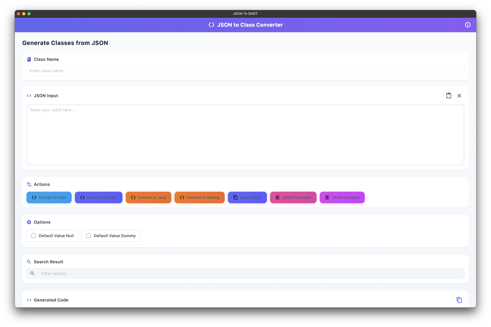

# JSON to Class Converter

A powerful Flutter application that allows you to convert JSON to classes in various programming languages with a beautiful, user-friendly interface.



## Features

### Multi-Language Support
- **Dart**: Generate Dart classes with proper typing and null safety support
- **Java**: Convert JSON to Java classes with getters and setters
- **Kotlin**: Generate Kotlin data classes with serialization annotations

### Customization Options
- **Class Name**: Specify a custom class name for the generated code
- **Nullable Types**: Option to generate nullable types for Dart classes
- **Default Values**: Choose between:
  - Default Value Null: Initialize properties with null
  - Default Value Dummy: Initialize properties with type-appropriate dummy values

### Advanced Functionality
- **Nested Classes**: Automatically generates classes for nested JSON objects
- **List Handling**: Properly handles lists and their item types
- **Search & Filter**: Search through generated code to find specific elements
- **Copy to Clipboard**: One-click copy of generated code
- **Paste from Clipboard**: Quickly paste JSON from clipboard with automatic formatting
- **Auto-Formatting**: Automatically formats and validates JSON when pasted

### User Interface
- **Modern Design**: Clean, intuitive interface with beautiful animations
- **Syntax Highlighting**: Code formatting for better readability
- **Responsive Layout**: Works well on different screen sizes

## How to Use

1. **Enter Class Name**: Provide a name for your primary class (e.g., "User", "Product")
2. **Input JSON**: Paste your JSON into the input field (it will be automatically formatted and validated)
3. **Select Options**:
   - Choose output language (Dart, Java, Kotlin)
   - Set nullable/default value preferences
4. **Generate Code**: Click the corresponding button to convert your JSON
5. **Search Results**: Use the search box to filter through generated code
6. **Copy Result**: Copy the generated code to your clipboard

## Example

### Input JSON
```json
{
  "id": 1,
  "name": "John Doe",
  "email": "john@example.com",
  "is_active": true,
  "address": {
    "street": "123 Main St",
    "city": "New York",
    "zip": "10001"
  },
  "tags": ["customer", "premium"]
}
```

### Output Dart Class
```dart
class User {
  final int id;
  final String name;
  final String email;
  final bool isActive;
  final Address address;
  final List<String> tags;

  User({
    required this.id,
    required this.name,
    required this.email,
    required this.isActive,
    required this.address,
    required this.tags,
  });

  factory User.fromJson(Map<String, dynamic> json) {
    return User(
      id: json['id'] ?? 0,
      name: json['name'] ?? '',
      email: json['email'] ?? '',
      isActive: json['is_active'] ?? false,
      address: json['address'] != null ? Address.fromJson(json['address']) : Address(),
      tags: json['tags'] != null ? List<String>.from(json['tags']) : [],
    );
  }

  Map<String, dynamic> toJson() {
    return {
      'id': id,
      'name': name,
      'email': email,
      'is_active': isActive,
      'address': address?.toJson(),
      'tags': tags,
    };
  }
}

class Address {
  final String street;
  final String city;
  final String zip;

  Address({
    required this.street,
    required this.city,
    required this.zip,
  });

  factory Address.fromJson(Map<String, dynamic> json) {
    return Address(
      street: json['street'] ?? '',
      city: json['city'] ?? '',
      zip: json['zip'] ?? '',
    );
  }

  Map<String, dynamic> toJson() {
    return {
      'street': street,
      'city': city,
      'zip': zip,
    };
  }
}
```

## Installation

1. Clone this repository
   ```bash
   git clone https://github.com/yourusername/json_to_class_converter.git
   ```

2. Navigate to the project directory
   ```bash
   cd json_to_class_converter
   ```

3. Install dependencies
   ```bash
   flutter pub get
   ```

4. Run the application
   ```bash
   flutter run
   ```

## Requirements

- Flutter 3.0 or higher
- Dart 3.0 or higher
- Plugins: window_manager, flutter_json_viewer

## Contributing

Contributions are welcome! Please feel free to submit a Pull Request.

## License

This project is licensed under the MIT License - see the LICENSE file for details.
